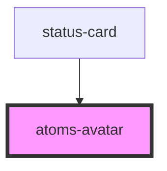

# atoms-avatar

<!-- Auto Generated Below -->

## Properties

| Property    | Attribute    | Description | Type     | Default                         |
| ----------- | ------------ | ----------- | -------- | ------------------------------- |
| `imageLink` | `image-link` |             | `string` | `'../../assets/img/avatar.png'` |
| `name`      | `name`       |             | `string` | `undefined`                     |

## Dependencies

### Used by

 - [status-card](../../status-card)

### Graph

----------------------------------------------

*Built with [StencilJS](https://stenciljs.com/)*
