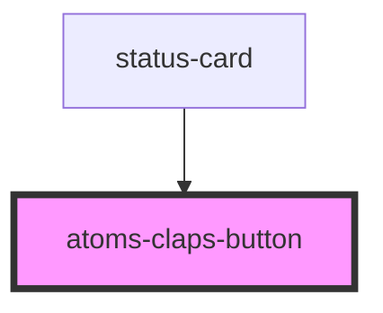

# atoms-claps-button

<!-- Auto Generated Below -->

## Properties

| Property     | Attribute     | Description | Type     | Default     |
| ------------ | ------------- | ----------- | -------- | ----------- |
| `clapsTotal` | `claps-total` |             | `number` | `undefined` |
| `domId`      | `dom-id`      |             | `number` | `undefined` |

## Events

| Event         | Description | Type                  |
| ------------- | ----------- | --------------------- |
| `buttonClick` |             | `CustomEvent<Object>` |

## Dependencies

### Used by

 - [status-card](../../status-card)

### Graph

----------------------------------------------

*Built with [StencilJS](https://stenciljs.com/)*
