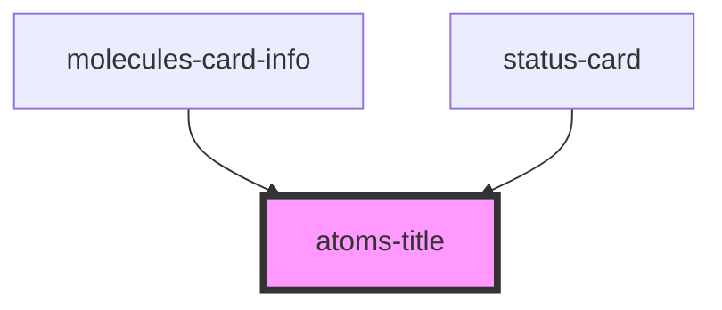

# atoms-title

<!-- Auto Generated Below -->

## Properties

| Property       | Attribute       | Description | Type     | Default     |
| -------------- | --------------- | ----------- | -------- | ----------- |
| `commentBody`  | `comment-body`  |             | `string` | `undefined` |
| `commentTitle` | `comment-title` |             | `string` | `undefined` |

## Dependencies

### Used by

 - [molecules-card-info](../../molecules/molecules-card-info)
 - [status-card](../../status-card)

### Graph

----------------------------------------------

*Built with [StencilJS](https://stenciljs.com/)*
