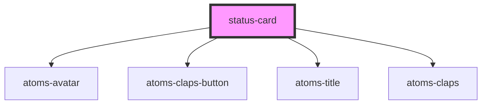

# my-component

<!-- Auto Generated Below -->

## Dependencies

### Depends on

- [atoms-avatar](../atoms/atoms-avatar)
- [atoms-claps-button](../atoms/atoms-claps-button)
- [atoms-title](../atoms/atoms-title)
- [atoms-claps](../atoms/atoms-claps)

### Graph

----------------------------------------------

*Built with [StencilJS](https://stenciljs.com/)*
